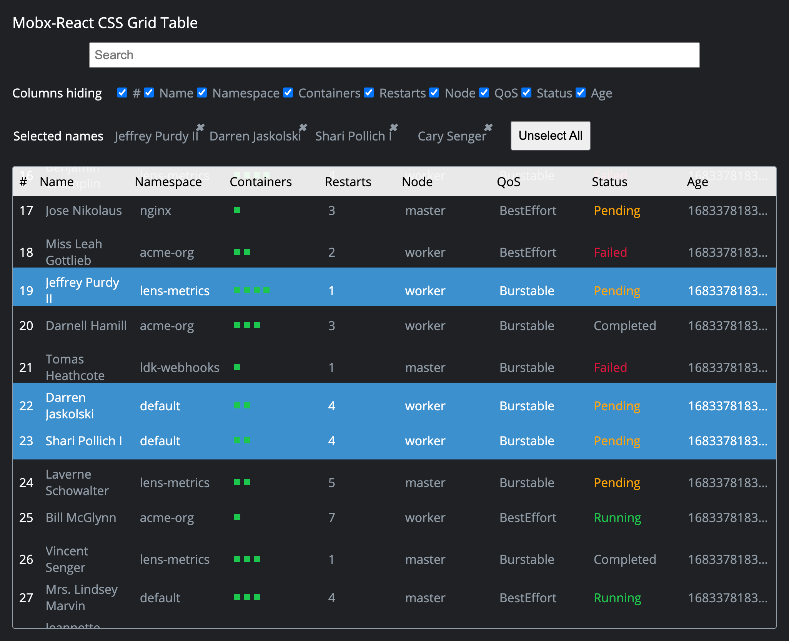

@ixrock/mobx-react-table-grid
==

Easy to use and powerful react table-grid based on CSS-grid layout component

## Install
```
npm install mobx-react-table-grid --save
```

## Benefits

- easy-to-follow and simple API _(just use as data input plain-objects and data-getters, mostly see `TableDataColumn` and `TableDataRow` interfaces)_
- table rows virtualization _(handle large amount of items, e.g. you can handle 10k pods from k8s, see the demo with generated data)_
- most of the layout done via `display: grid` with some help of css-variables _(works really fast!)_ 
- multi-columns sorting _(powered by `lodash/orderBy`)_ 
- reordering and resizing columns _(powered by `react-dnd`)_ 
- filtering columns _(show/hide/search)_ 
- rows selection state management
- handling import/export state to external storage (e.g. `window.localStorage`, see: `demo.tsx`)
- customize column sizes via css-variables `--grid-col-size-${columnId}` _(see usage in `demo.module.css`)_
- `mobx` observability for grid state management under the hood

## Demo




```
git checkout git@github.com:ixrock/mobx-react-table-grid.git
npm install
npm run dev
```


## Example

```tsx
import "mobx-react-table-grid/index.css"; // import styles (e.g. in webpack)
import React from "react"
import ReactDOM from "react-dom"
import { observable } from "mobx"
import { inject, observer } from "mobx-react"
import { CreateTableState, createTableState, Table, bindAutoSaveChangesToStorage } from "mobx-react-table-grid";

interface MyResourceDataType {
  name: string;
  renderName(): React.ReactNode;
};

const tableState = createTableState<MyResourceDataType>({
  /* some iterable data items , e.g. `K8s.Pod[]` */
  dataItems: observable.array<MyTableGridDataItem>(),
  
  headingColumns: [
    {
      id: "index",
      title: <b>#</b>,
      renderValue: (row, col) => row.index,
    },
    {
      id: ResourceColumnId.name,
      title: <>Name</>,
      renderValue: (row, col) => <b>{row.data.renderName()}</b>,
      sortValue: (row, col) => row.data.name,
    },
  ]
});

const Demo = observer((props: {store: CreateTableState}) => {
  const { tableColumns, sortedTableRows } = props.store;

  return <Table
    header={<b>Table Header</b>}
    columns={tableColumns.get()}
    rows={sortedTableRows.get()}
  />
});

/**
 * Preload -> import -> auto-save table state changes with external storage, e.g. `window.localStorage`
 * @optional
 */
bindAutoSaveChangesToStorage<ResourceStub>({
  tableId: "demo",
  tableState: tableState,
  toStorage(tableId, state) {
    window.localStorage.setItem(tableId, JSON.stringify(state));
  },
  async fromStorage(tableId: string) {
    return JSON.parse(window.localStorage.getItem(tableId) ?? `{}`);
  }
}).then(() => {
  ReactDOM.render(<Demo store={tableState}/>, document.getElementById('app'));  
});
```
